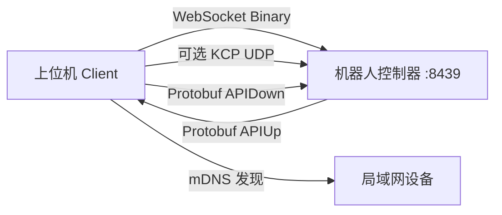
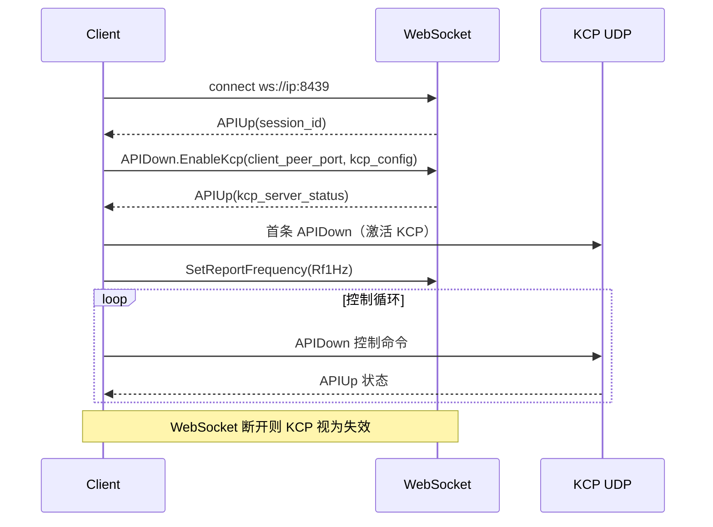
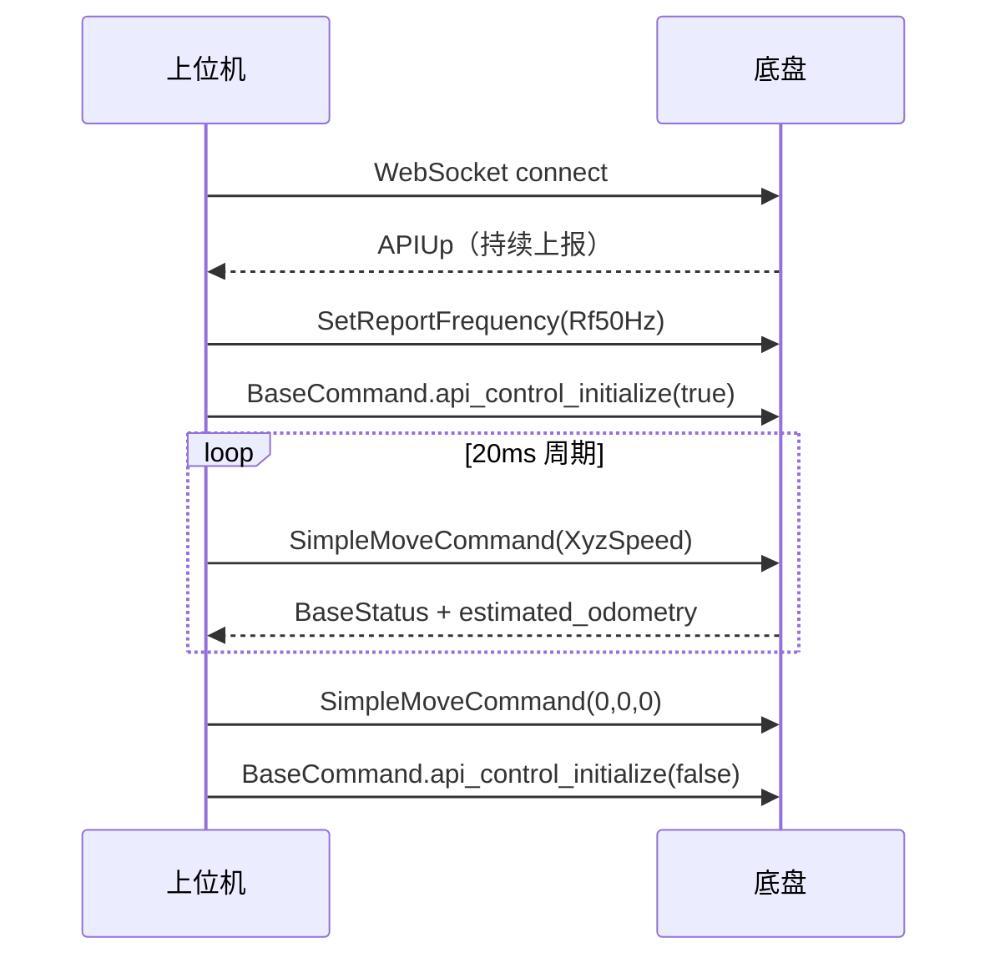
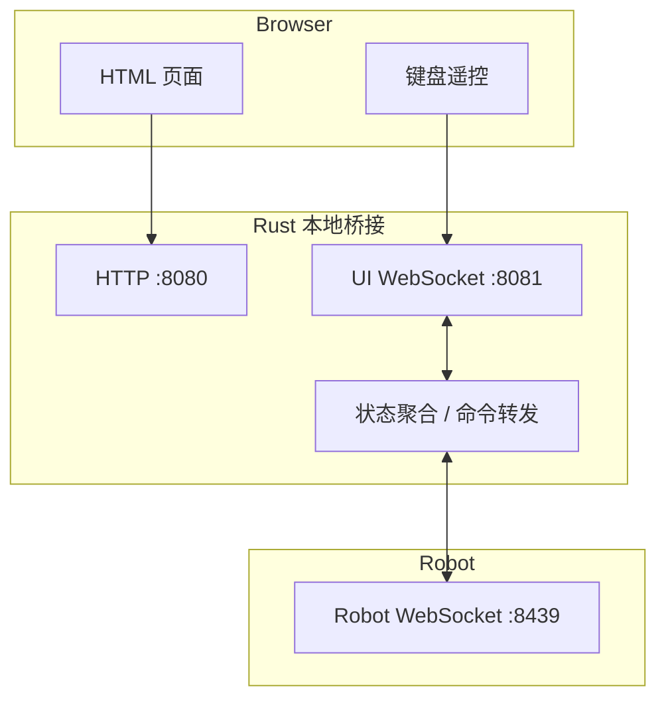

# robot-demos 项目介绍

本文档面向需要理解、集成或二次开发 HexFellow 机器人 API 的开发者，说明本仓库的定位、整体架构、通信流程、协议接口与示例程序。

> 协议定义来源：[hexfellow/proto-public-api](https://github.com/hexfellow/proto-public-api)  
> 本仓库通过 git submodule 引入，路径为 `src/proto-public-api/`。

---

## 1. 项目定位

`robot-demos` 是一个**示例驱动**的机器人开发仓库，目标不是替代官方 SDK，而是帮助开发者：

- 理解 HexFellow 公共 API 的通信方式
- 学会连接机器人、解析状态、发送控制命令
- 在不同语言/传输方式下快速验证集成方案

本仓库**不是**：

- 完整机器人能力展示平台
- 可跳过阅读代码的“黑盒 SDK”
- 生产级控制框架

官方建议：Python 生产环境优先使用 [hex_device_python](https://github.com/hexfellow/hex_device_python)。

---

## 2. 仓库结构

```text
robot-demos/
├── src/
│   ├── lib.rs                 # 公共库：连接、解码、发送、日志等
│   ├── main.rs                # mDNS 设备发现 demo
│   └── proto-public-api/      # Protobuf 协议子模块
├── examples/                  # Rust 示例（最完整）
├── python/                    # Python 最小示例
├── c/                         # C 示例（Linux，nanopb + mongoose）
├── cpp/                       # C++ 参考实现
├── build.rs                   # prost 编译 proto
├── Cargo.toml
├── README.md                  # 英文快速上手
├── TESTING.md                 # 构建与联调测试方案
└── INTRODUCTION_CN.md         # 本文档
```

### 2.1 核心 Rust 库能力

`src/lib.rs` 提供所有示例复用的基础能力：


| 函数/模块                                  | 作用                                   |
| -------------------------------------- | ------------------------------------ |
| `proto_public_api`                     | prost 生成的 Protobuf 类型                |
| `connect_websocket()`                  | 建立 WebSocket 连接并设置 `TCP_NODELAY`     |
| `decode_websocket_message()`           | 将 WebSocket Binary 帧解码为 `ApiUp`      |
| `send_api_down_message_to_websocket()` | 将 `ApiDown` 编码后通过 WebSocket 发送       |
| `create_kcp_socket()`                  | 创建 KCP 所需 UDP socket（feature: `kcp`） |
| `confirm_and_continue()`               | 交互式确认是否连接机器人                         |
| `init_logger()`                        | 初始化日志                                |


协议版本常量：

```rust
// src/proto-public-api/version.rs
CURRENT_PROTOCOL_MAJOR_VERSION = 1
CURRENT_PROTOCOL_MINOR_VERSION = 6
```

---

## 3. 通信架构

### 3.1 总体模型




- **传输层**：默认 WebSocket；可选 KCP（更低延迟）
- **数据层**：Google Protobuf
- **消息方向**：
  - 机器人 → 上位机：`APIUp`
  - 上位机 → 机器人：`APIDown`
- **帧类型**：只允许 **Binary** 消息；Text 消息会被视为错误

### 3.2 WebSocket 连接

典型连接地址：

```text
ws://<robot-ip>:8439
ws://[fe80::xxxx:xxxx%zone_id]:8439   # IPv6 需带 zone id（接口编号，不是网卡名）
```

连接后机器人会持续推送 `APIUp`。每个连接有独立 `session_id`，可独立设置上报频率。

### 3.3 KCP 连接（可选）

适用场景：对延迟/抖动敏感，且已熟悉 KCP。

握手流程：




关键约束：

- KCP 必须先通过 WebSocket 握手
- `conv id = session_id`
- WebSocket 连接必须保持存活
- KCP 数据帧需按 HexSocket 4 字节头解包

### 3.4 设备发现（mDNS）

`cargo run`（`src/main.rs`）会浏览 `_hexfellow._tcp.local.`，输出：

- 设备 hostname
- IPv4/IPv6 地址
- `MainRobotType` / `SecondaryRobotType`

适合在不知道 IP 时先定位设备。

---

## 4. 协议接口说明

协议文件：


| 文件                       | 内容             |
| ------------------------ | -------------- |
| `public_api_up.proto`    | 上行消息 `APIUp`   |
| `public_api_down.proto`  | 下行消息 `APIDown` |
| `public_api_types.proto` | 各设备状态/命令/公共类型  |


### 4.1 APIUp（机器人 → 上位机）

```protobuf
message APIUp {
    RobotType robot_type = 1;
    uint32 protocol_major_version = 17;
    uint32 protocol_minor_version = 18;
    oneof status {
        BaseStatus base_status = 2;
        LinearLiftStatus linear_lift_status = 3;
        ArmStatus arm_status = 4;
        RotateLiftStatus rotate_lift_status = 5;
    }
    repeated SecondaryDeviceStatus secondary_device_status = 16;
    optional string log = 14;
    ReportFrequency report_frequency = 12;
    uint32 session_id = 15;
    optional KcpServerStatus kcp_server_status = 19;
    optional TimeStamp time_stamp = 20;
    optional float main_bus_voltage = 21;
}
```

解析时通常先判断 `robot_type` 和 `status` 的 oneof 分支。

### 4.2 APIDown（上位机 → 机器人）

```protobuf
message APIDown {
    oneof down {
        BaseCommand base_command = 1;
        LinearLiftCommand linear_lift_command = 2;
        ArmCommand arm_command = 3;
        RotateLiftCommand rotate_lift_command = 4;
        ReportFrequency set_report_frequency = 5;
        SecondaryDeviceCommand secondary_device_command = 7;
        EnableKcp enable_kcp = 8;
        RebootRequest reboot_request = 13;
        bool placeholder_message = 100;
    }
    uint32 protocol_major_version = 11;
    uint32 protocol_minor_version = 12;
}
```

每次发送一条命令（oneof），便于实现 MPSC 命令队列。

### 4.3 上报频率

```protobuf
enum ReportFrequency {
    Rf1000Hz = 0;
    Rf500Hz = 3;
    Rf250Hz = 4;
    Rf100Hz = 1;
    Rf50Hz = 2;
    Rf1Hz = 5;
}
```

- 每个 WebSocket 连接可独立设置
- 简单 demo 建议 `Rf50Hz`，避免日志刷屏
- 使用 KCP 时，WebSocket 建议降到 `Rf1Hz` 仅作保活

### 4.4 Session 与控制权

多个客户端可同时连接同一机器人，但**控制权由 session holder 决定**：

- `APIUp.session_id`：当前连接 ID
- `BaseStatus.session_holder`：当前持有 API 控制权的 session（0 表示无人持有）
- 只有 session holder 可发送完整控制命令
- 非 holder 通常只能发送 `clear_parking_stop`

---

## 5. 底盘（Base）流程分析

底盘是本仓库示例最完整的部分，推荐从这里入手。

### 5.1 标准控制生命周期




### 5.2 关键状态字段（BaseStatus）


| 字段                        | 含义                                                           |
| ------------------------- | ------------------------------------------------------------ |
| `state`                   | 底盘状态：`BsParked` / `BsAlgorithmControl` / `BsEmergencyStop` 等 |
| `api_control_initialized` | 是否已进入 API 控制                                                 |
| `battery_voltage`         | 电池电压 (V)                                                     |
| `battery_thousandth`      | 电量千分比                                                        |
| `session_holder`          | 当前控制会话 ID                                                    |
| `estimated_odometry`      | 估计速度/位姿                                                      |
| `motor_status`            | 各电机状态                                                        |
| `parking_stop_detail`     | 停车保护详情                                                       |
| `warning`                 | 告警类别                                                         |


### 5.3 里程计（BaseEstimatedOdometry）


| 字段                   | 单位    | 说明  |
| -------------------- | ----- | --- |
| `speed_x`, `speed_y` | m/s   | 线速度 |
| `speed_z`            | rad/s | 角速度 |
| `pos_x`, `pos_y`     | m     | 位置  |
| `pos_z`              | rad   | 航向角 |


### 5.4 运动命令（SimpleBaseMoveCommand）

```protobuf
message XyzSpeed {
    float speed_x = 1;  // 前进方向速度
    float speed_y = 2;  // 侧向速度
    float speed_z = 3;  // 旋转角速度
}
```

也可发送：

- `zero_resistance`：零阻力模式
- `brake`：刹车

### 5.5 必须遵守的控制约束

1. **先初始化再控制**：必须 `api_control_initialize(true)` 后才能发运动命令
2. **持续发送命令**：控制期间需周期性发送（示例通常 20ms/50Hz）
3. **结束必须反初始化**：长时间失去控制会进入保护状态
4. **协议版本要匹配**：`protocol_major_version` 不一致会导致兼容问题

参考实现：`examples/base-ez-control-websocket.rs`

---

## 6. 其他设备接口概览

### 6.1 线性升降机（Linear Lift）

**状态**：`LinearLiftStatus`

- `calibrated`, `state`, `max_pos`, `current_pos`, `speed`

**命令**：`LinearLiftCommand`

- `calibrate`：校准
- `target_pos`：目标编码器位置
- `set_speed`：速度
- `brake`：刹车

示例：`examples/linear-lift-move-websocket.rs`

### 6.2 旋转升降机（Rotate Lift）

**状态**：`RotateLiftStatus`  
**命令**：`RotateLiftCommand`（`calibrate` / `motor_targets` / `runtime_config`）

示例：`examples/rotational-lift-move-to-zero-position-websocket.rs`

### 6.3 机械臂（Arm）

**状态**：`ArmStatus`

- `api_control_initialized`, `calibrated`, `motor_status`, `session_holder`

**命令**：`ArmCommand`（力矩/位置/模式等，见 proto 扩展段）

示例：`examples/arm-ez-control.rs`

### 6.4 次级设备（Secondary Device）

通过 `secondary_device_status` 上报，例如：

- IMU (`ImuData`)
- 手柄 (`Gamepad`)
- 末端手爪 (`HandStatus`)

命令通过 `SecondaryDeviceCommand` 下发。

### 6.5 重启命令

```protobuf
message RebootRequest {
    uint64 reboot_magic_number = 1;  // 必须为 0x0065686e6f73696b
    RebootMode reboot_mode = 2;
}
```

示例：`examples/reboot-app-with-motor-power-cut.rs`

---

## 7. 示例程序索引

### 7.1 Rust 示例（推荐）


| 示例                                                | 传输                     | Feature     | 功能                    |
| ------------------------------------------------- | ---------------------- | ----------- | --------------------- |
| `main`（默认 bin）                                    | mDNS                   | 无           | 发现局域网 HexFellow 设备    |
| `basic-websocket`                                 | WebSocket              | 无           | 打印机器人类型/协议版本/session  |
| `websocket-print-everything`                      | WebSocket              | 无           | 打印完整 `APIUp`          |
| `base-ez-control-websocket`                       | WebSocket              | 无           | 底盘最小控制（旋转 0.1 rad/s）  |
| `base-ez-control`                                 | KCP                    | `kcp`       | 同上，KCP 传输             |
| `base-control-motor-limit-current`                | KCP                    | `kcp`       | 底盘电机限流控制              |
| `base-gui-websocket`                              | WebSocket + 本地 HTTP/WS | 无           | 网页 GUI 可视化 + 键盘遥控     |
| `linear-lift-move-websocket`                      | WebSocket              | 无           | 线性升降机移动到百分比位置         |
| `rotational-lift-move-to-zero-position-websocket` | WebSocket              | 无           | 旋转升降机回零               |
| `arm-ez-control`                                  | KCP                    | `kcp`       | 机械臂零力矩控制              |
| `arm-plotjugger-show-motor-status`                | WebSocket              | 无           | 输出 PlotJuggler 格式电机数据 |
| `hello-read`                                      | KCP                    | `kcp`       | HELLO 控制器读取与 LED 控制   |
| `read-time-stamp-websocket`                       | WebSocket              | 无           | 读取 PTP 时间戳            |
| `reboot-app-with-motor-power-cut`                 | WebSocket              | 无           | 带电机断电的应用重启            |
| `zenoh-read`                                      | Zenoh                  | `tui`       | TUI 方式读取 Zenoh 上报     |
| `legacy-lift-simulator`                           | SocketCAN              | `socketcan` | 旧版升降机模拟（仅 Linux）      |


### 7.2 Python 示例

路径：`python/`

- `base-ez-control.py`：底盘最小 WebSocket 控制
- `read_ptp_clock.py`：PTP 时钟读取

需先 `python3 setup.py build_py` 编译 proto。

### 7.3 C/C++ 示例

路径：`c/`、`cpp/`

- C：mongoose + nanopb，Linux only
- C++：WebSocket/KCP 参考实现

---

## 8. GUI 可视化方案（base-gui-websocket）

本仓库新增的 GUI 示例采用“**Rust 桥接 + 浏览器前端**”架构：




### 8.1 启动方式

```bash
cargo run --example base-gui-websocket -- <robot-ip> 8439
```

浏览器访问：`http://127.0.0.1:8080`

### 8.2 数据流

1. Rust 连接机器人 WebSocket，解码 `APIUp`
2. 提取 `BaseStatus` 转为 JSON `DashboardSnapshot`
3. 通过 UI WebSocket 推送给浏览器
4. 浏览器键盘事件转为 `DriveCommand`
5. Rust 转为 `APIDown.BaseCommand.SimpleMoveCommand`

### 8.3 前端 JSON 接口

**下行（浏览器 → 桥接）**

```json
{
  "type": "drive",
  "enabled": true,
  "vx": 0.25,
  "vy": 0.0,
  "wz": 0.5
}
```

**上行（桥接 → 浏览器）**

```json
{
  "robot_connected": true,
  "api_control_initialized": true,
  "base_state": "BsAlgorithmControl",
  "battery_voltage": 48.2,
  "battery_thousandth": 860,
  "session_holder": "12345",
  "odom": {
    "speed_x": 0.1,
    "speed_y": 0.0,
    "speed_z": 0.05,
    "pos_x": 1.2,
    "pos_y": 0.3,
    "pos_z": 0.78
  },
  "warning": null,
  "last_error": null,
  "last_update_ms": 1718198400123
}
```

### 8.4 键盘映射


| 按键                    | 功能                          |
| --------------------- | --------------------------- |
| W / ↑                 | 前进                          |
| S / ↓                 | 后退                          |
| A / ←                 | 左平移                         |
| D / →                 | 右平移                         |
| Q                     | 逆时针旋转                       |
| E                     | 顺时针旋转                       |
| Space                 | 停止                          |
| Shift + 方向键           | 加速                          |
| Enable API Control 按钮 | 切换 `api_control_initialize` |


---

## 9. 典型开发流程建议

### 9.1 第一次连接机器人

1. `cargo run` 用 mDNS 找到设备 IP
2. 运行 `basic-websocket` 确认协议版本与 `robot_type`
3. 运行 `websocket-print-everything` 观察完整状态结构
4. 阅读对应设备的 proto 字段定义

### 9.2 实现底盘控制

1. 复制 `base-ez-control-websocket.rs` 作为模板
2. 增加自己的运动学/导航逻辑
3. 保持 20ms 级命令发送频率
4. 在进程退出/断连时发送停止并 `api_control_initialize(false)`

### 9.3 从 Demo 走向生产


| 阶段        | 建议                       |
| --------- | ------------------------ |
| 学习验证      | 使用本仓库 examples           |
| Python 生产 | 迁移到 `hex_device_python`  |
| 低延迟场景     | 评估 KCP，先用 WebSocket 验证逻辑 |
| 多机器人管理    | 自行实现连接池、session 管理、异常恢复  |


---

## 10. 构建与测试

详细步骤见 [TESTING.md](./TESTING.md)。

常用命令：

```bash
# 安装 Rust 后
. "$HOME/.cargo/env"

# 编译 GUI
cargo check --example base-gui-websocket

# 编译所有默认 examples
cargo check --examples

# macOS 可构建的 feature 组合
cargo check --all-targets --features kcp,tui
```

注意：`socketcan` feature 仅 Linux 可用。

---

## 11. 常见问题

### Q1: 连接成功但没有底盘状态？

检查 `APIUp.status` 的 oneof 分支是否为 `base_status`。如果连接的是机械臂或升降机，状态字段会不同。

### Q2: 发了运动命令但底盘不动？

常见原因：

- 未 `api_control_initialize(true)`
- 不是 `session_holder`
- 处于 `parking_stop` / `BsEmergencyStop`
- 命令发送频率过低，触发 API 超时保护

### Q3: IPv6 连接失败？

IPv6 地址必须带 zone id，且 zone id 是**接口编号**不是网卡名，例如：

```text
[fe80::500d:96ff:fee1:d60b%3]
```

### Q4: 协议版本不匹配怎么办？

对比：

- 机器人上报的 `protocol_major_version` / `protocol_minor_version`
- 本仓库 `src/proto-public-api/version.rs`

major 不一致需升级固件或更新 proto；minor 不一致通常可兼容，但建议保持同步。

---

## 12. 相关链接


| 资源             | 地址                                                                                                                                     |
| -------------- | -------------------------------------------------------------------------------------------------------------------------------------- |
| 本仓库            | [https://github.com/siyaofu3931/robot-demos](https://github.com/siyaofu3931/robot-demos)                                               |
| 协议仓库           | [https://github.com/hexfellow/proto-public-api](https://github.com/hexfellow/proto-public-api)                                         |
| Python SDK     | [https://github.com/hexfellow/hex_device_python](https://github.com/hexfellow/hex_device_python)                                       |
| KCP bindings   | [https://github.com/hexfellow/kcp-bindings](https://github.com/hexfellow/kcp-bindings)                                                 |
| KCP 与 TCP 协作说明 | [https://github.com/skywind3000/kcp/wiki/Cooperate-With-Tcp-Server](https://github.com/skywind3000/kcp/wiki/Cooperate-With-Tcp-Server) |


---

## 13. 文档维护说明

- 协议字段以 `src/proto-public-api/*.proto` 为准
- 示例行为以 `examples/` 源码为准
- 若协议升级，请同步更新 submodule 与 `version.rs`
- 测试方案变更请同步更新 `TESTING.md`

